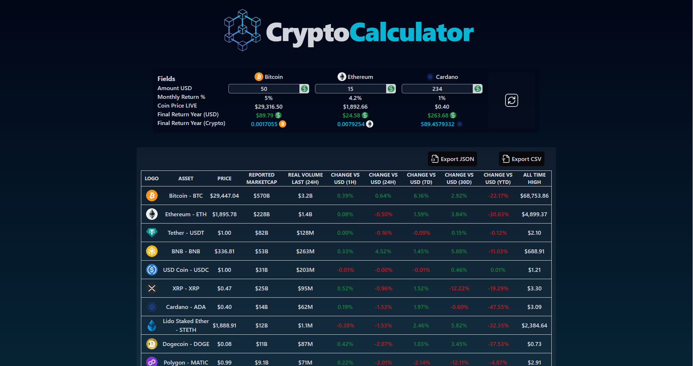
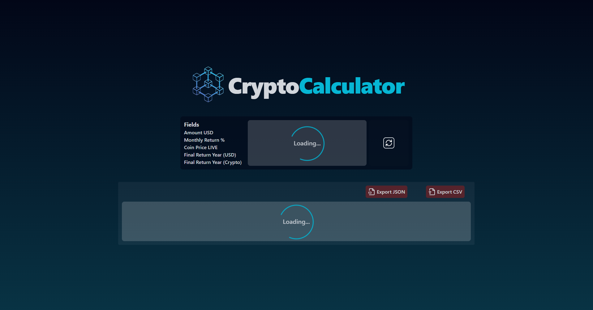
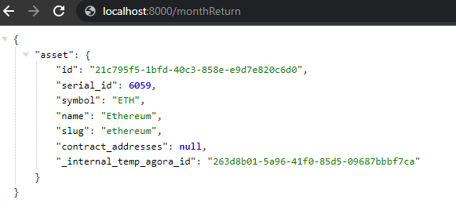
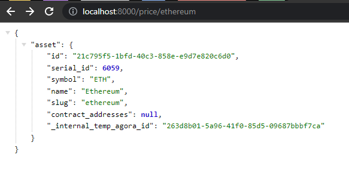

# Notes

## TO DO

Setup project Macro => **express, react, typescript**

### Calculator

- [x] Fetch data from API
- [x] Calculate compound interest (Year)
- [x] Calculate the crypto amount
- [x] Refresh the API to change value and interest
- [x] Style with tailwind
- [x] Load icons from the API
- [x] Load icons from lucide
- [x] Loading component
- [x] In case that we add a dialogs, alerts or other nested components add Redux and also shows usage of redux

### Live Crypto

- [x] Live data from the socket event 'prices'
- [x] Select colums as headers for the table
- [x] Match those colums in the table fields
- [x] Dinamic colors if change is up or down
- [x] Style with tailwind
- [x] Load icons from the API
- [x] Skeleton or loading component
- [x] JSON export button
- [x] JSON export funciton that takes the (assets) and return json data of it
- [x] CSV export button
- [x] CSV export funciton that takes the (assets) and return csv data of it

#### BACK

- [x] Fetch data from API
- [x] Think logic to clean it
- [x] Create Services to handle action logic
- [x] Create Controllers to handle some errors
- [x] Create Test to test some endpoints with supertest and jest
- [x] WebSocket emit prices on connect
- [x] WebSocket emit prices on interval of time
- [x] WebSocket emit prices only if users are avaliable
- [x] Variable that handles user count (+1 if connects & -1 if disconects)

#### FRONT

- [x] Listen Socket
- [x] Create State
- [x] AutoUpdates with use effect and WebSocket
- [x] Create table component
- [x] Filter data
- [x] Add class colors to change vs usd
- [x] Format coins
- [x] Download JSON
- [x] Style with tailwind and some components
- [x] Download CSV
- [x] Fragment to make the project more readable
- [ ] test with jest and vitest _(No more quota)_

## Main Back Packages (Express)

### DevDependencies (Express)

- [x] nodemon
- [x] concurrently
- [x] typescript
- [x] eslint

#### Test (Express)

- [x] jest
- [x] supertest
- [x] ts-jest

### Dependencies (Express)

- [x] csvtojson
- [x] axios
- [x] express
- [x] dotenv
- [x] socket.io
- [x] morgan
- [x] ts-node
- [x] cors
- [x] zod

---

## Main Front Packages (React)

### DevDependencies (React)

- [x] autoprefixer
- [x] postcss
- [x] prettier
- [x] eslint
- [x] tailwindcss
- [x] vite

#### Test (React)

- [ ] jest
- [ ] vitest

### Dependencies (React)

- [x] react
- [x] react-dom
- [x] lucide-react
- [x] react-redux
- [x] socket.io-client
- [x] zod

---

## Screenshots

### With all assets live and calculator

### Loading state

### Back response /monthReturn

### Back response /price/ethereum

## Conclusion

Pretty funny project (9.5/10).

Made by Sebastian Alejandro Caicedo Enriquez. aka **Alcaen**
